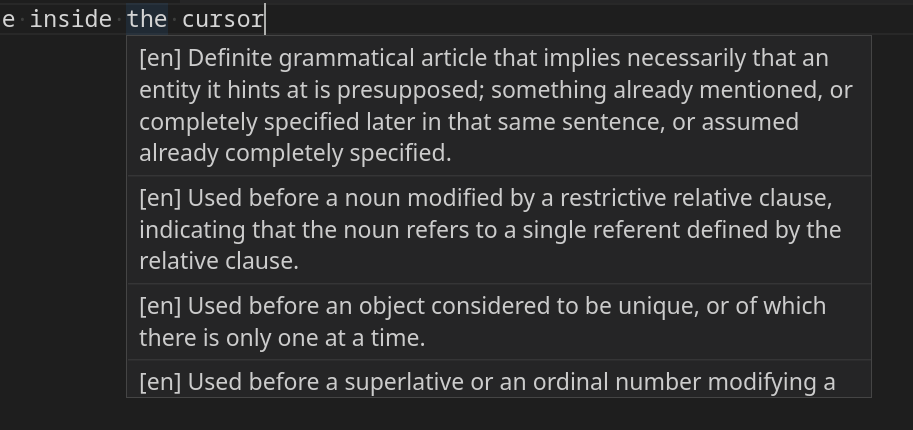

# wiktionaryhelp

This is a VSCode extension that queries a local HTTP server showing word definitions when hovering the mouse over a word on Markdown files.

To use it you need first to [set up a local Wiktionary server](https://github.com/jacopofar/wiktionary-http-server), the URL can be customized in order to share an instance.

The server can be configured with many languages at the same time although the definitions are always in English.

## Features

Hovering the mouse over a word will show a popup with its definitions in English. When text is selected then hovering on it will show the definition of the selection instead, useful for substrings or terms composed of multiple tokens.
## Requirements

You can use the multilingual server at https://yetanotherdictionary.eu

Otherwise, you need to [set up a local Wiktionary server](https://github.com/jacopofar/wiktionary-http-server), which is simple as it requires only Python 3 and no further dependencies. You will also need to download the Wiktextract files corresponding to the language (or languages) you are interested to.

## Extension Settings

This extension contributes the following settings:

* `wiktionaryhelp.wiktionaryserverURL`: The base URL of the wiktionary server API.

## Known Issues

None so far, PR and issues are welcome

---

## Roadmap

Things that may be implemented in future versions:

* meaningful tests
* more details (synonyms, verb conjugations, etc.)
* tokenization for languages that don't use spaces
* an online dictionary server
* let users take notes on words
* highlight words not in the dictionary